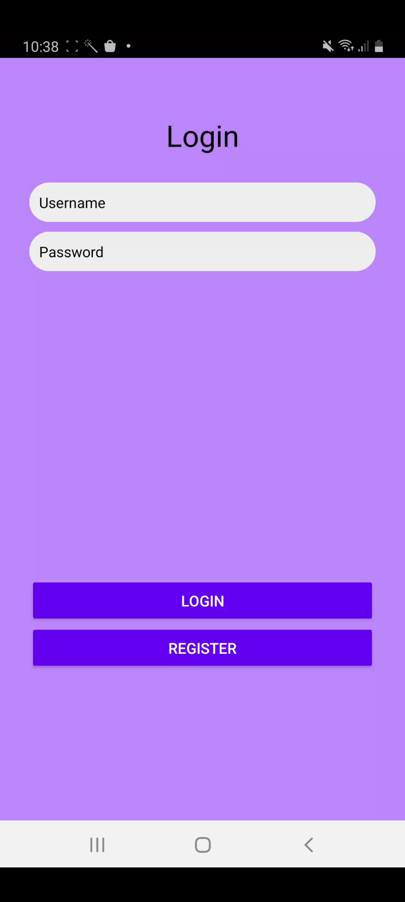
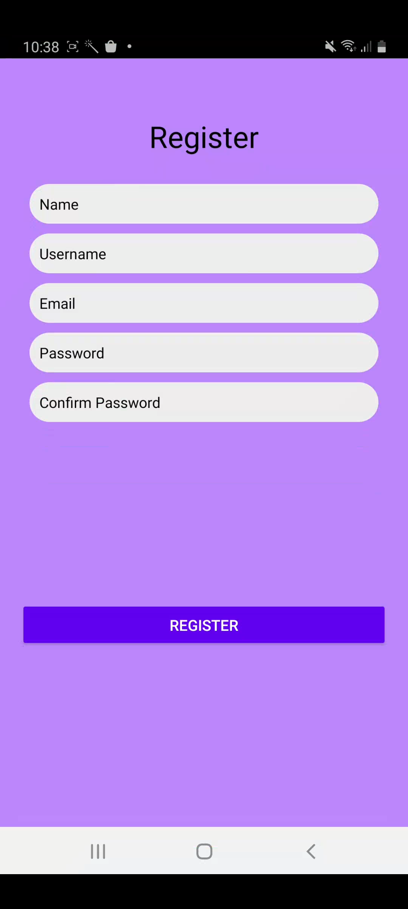
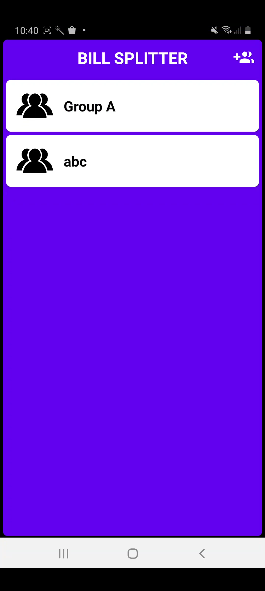
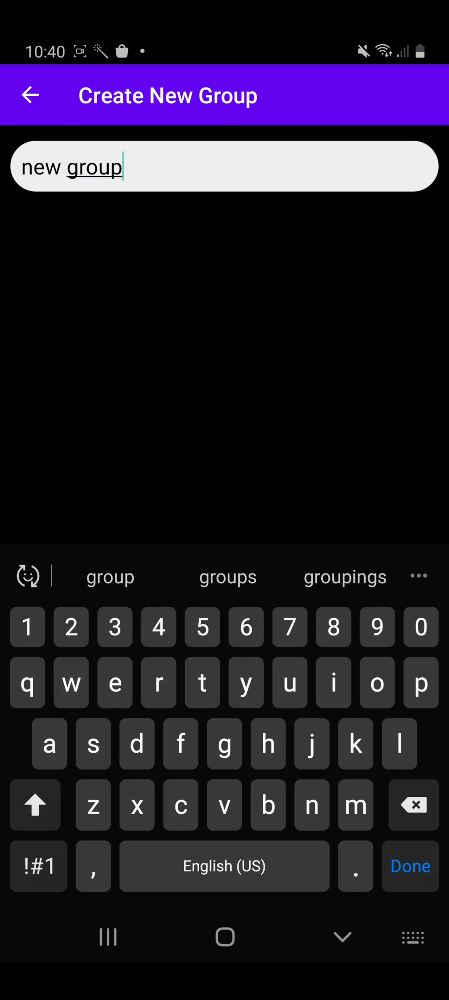
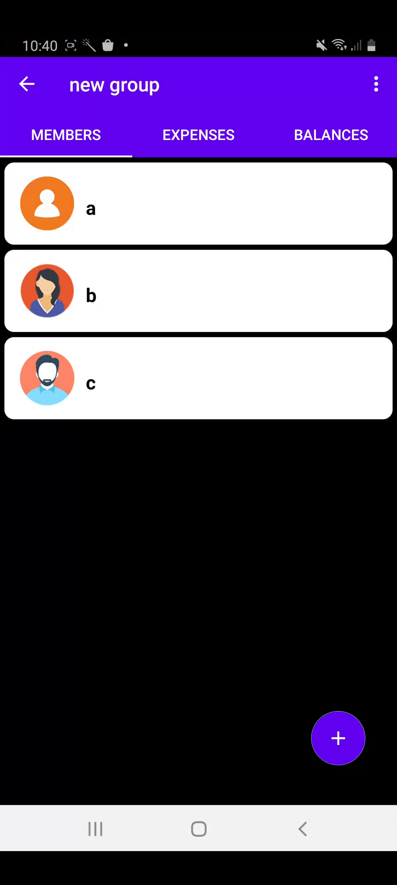
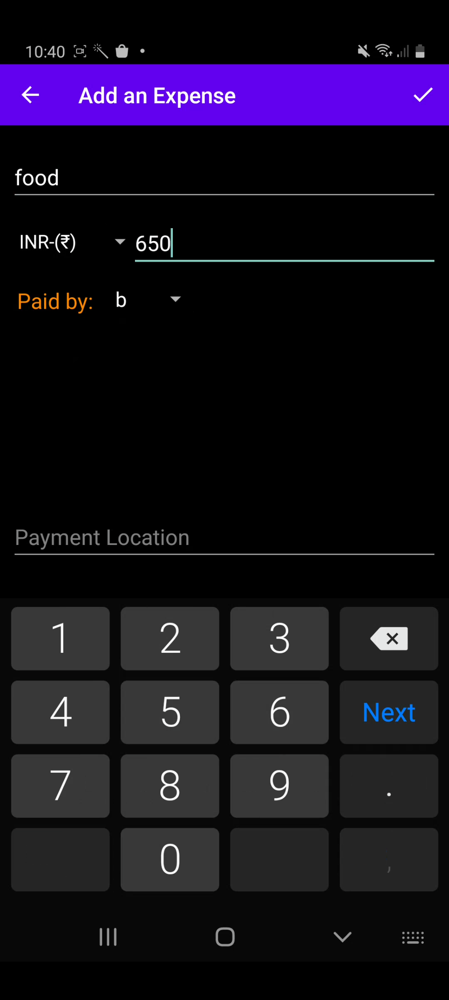
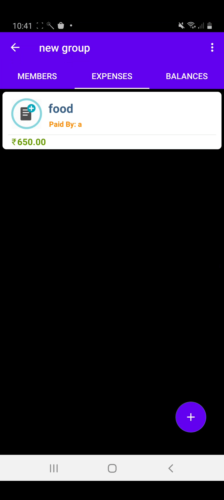
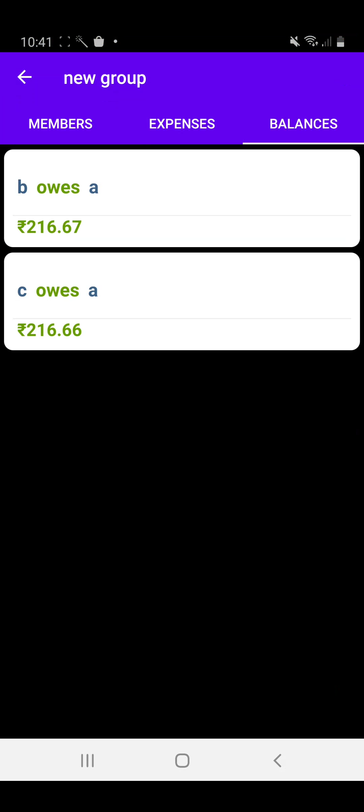

# Bill Splitter

A mobile application for Android that helps you split expenses among groups easily and accurately.

## About

Bill Splitter is an Android application designed to simplify expense sharing among groups. It helps users track shared expenses during meetups, trips, or any group activities by providing an intuitive interface to record expenses and calculate settlements automatically.

## Features

- **User Authentication**: Secure login and registration system
- **Group Management**: Create and manage multiple expense-sharing groups
- **Expense Tracking**: Record expenses with details (item name, cost, payer)
- **Bill Capture**: Built-in camera functionality to capture pictures of bills/receipts
- **Location Services**: Track where money was spent using GPS
- **Automatic Calculations**: Calculates "who owes who and by how much"
- **Multi-currency Support**: Add expenses in different currencies
- **Balance Overview**: Clear visualization of outstanding balances between members

## Screenshots

  
  
  
  

  
  
  
  

## Technology Stack

- **Frontend**: XML layouts (Linear, Relative, Constraint)
- **Backend**: Java/Kotlin
- **Authentication**: Firebase Authentication
- **Database**: Room Database & Firebase
- **APIs**: Camera API, Location API

## Android Components Used

- Activities and Intents
- Fragments
- RecyclerView
- Room Database
- Firebase Integration
- GPS Location
- Camera

## Installation

1. Clone this repository
2. Open the project in Android Studio
3. Sync Gradle files
4. Run on an emulator or physical device

## Requirements

- Android 5.0 (Lollipop) or higher
- Location permissions
- Camera permissions
- Internet connection

## Contributors

- Aanchal Mani (118A3001)
- Rabiya Idrishi (118A3017)
- Suraj Iyer (118A3020)

## License

This project is licensed under the MIT License - see the LICENSE.md file for details.
